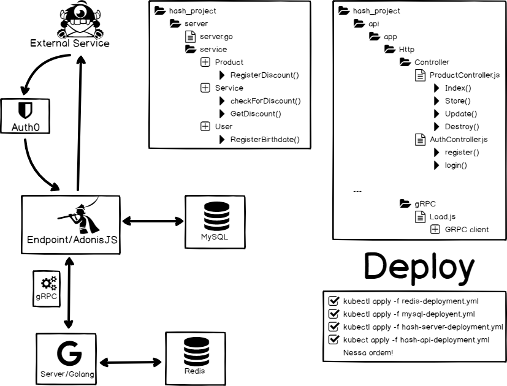
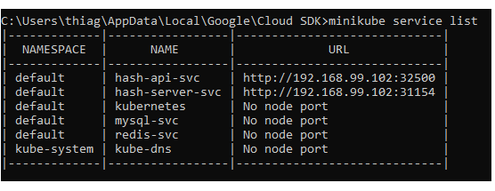

# Desafio backend Hash

Bom, essa é a minha aplicação... Estou com o tempo muito apertado, fiz pouco a pouco entao pode ser que 
algumas coisas estejam erradas, meio confusas e desculpa pelos console.logs esquecidos. (hihihi)
Mas isso nao é desculpa nem nada, o comando foi claro e essa é uma tentiva bastante honesta sobre o que eu sei fazer e posso entregar.

# Wireframe do projeto



Essa foi a linha de raciocinio seguida para atender o comando do desafio, tentei emplacar o maximo dos conhecimentos que eu tenho, mas 
tambem nao queria pecar em overkill... Pois eu acho que simplicidade e clareza tambem sao importantes em qualquer coisa que fazemos


# Instalando

Para instalar é só seguir os passos descritos em *Deploy*, no ambiente do *Minikube* que é propicio para testes em Kubernetes.
Após o deploy, entre com o comando *minikube service list* para pegar a url dos serviços, o resultado é algo do tipo:



A url da api é o hash-api-svc.

# Testando

Primeiro voce se registra na rota POST('/register')

```JSON
    {  
	    "username": "Thiago 19",  
	    "email":"thiago19@gmail.com",  
	    "password": "senha10",  
	    "birthdate": "1992-02-17"  
    }
```
 
 
Depois voce loga em POST('/login')

```JSON
    {  
	    "user":{  
		  "email":"thiago19@gmail.com",  
		  "password": "senha10"  
	    }  	
    }
```
E pronto, as outras rotas são:  
  - GET('/product') para a listagem de produtos  
  - GET('/') para health check  
  - POST('/product') para inserir um produto
  
  ```
      {  
	      "price_in_cents": 1000,  
	      "title": "Pirulito",  
	      "description": "doce"  
      }
 ```
      
# Wrap

Lembrando de passar o token recebida em */login* nas requisições de */product* no header como Authorization para validar e indentificar  .Isso talvez possa fugir um pouco do comando que dizia para passar o id no header mas o uso de JWT é o que eu venho usando bastante nos  ultimos tempos entao por isso optei por esse caminho.  
Entao é isso. Nao vou detalhar muito aqui para a conversa render mais, entao por favor façam o deploy ai... testem e vamos conversar!

# Disclaimer

Infelizmente nao tive tempo de colocar os testes unitarios, tanto do lado do JS quando do lado do Go. Estou ciente que isso é um ponto um tanto negativo.

